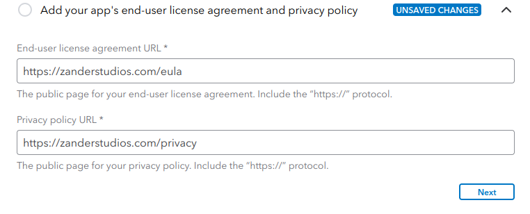

# QuickBooks-Integration-HowTo
A step-by-step guide to connecting a QuickBooks Online account to DUKE.AI Load Transmission services.

## Messy Walkthrough

### The Example Companies
This guide details a sample workflow between a Broker/Carrier and a Factor. In this example:
 - C-Train Ventures (CTV) is a fictional Broker that uses Zander Studios (ZSF) as a Factor.
 - ZSF is the Factoring company in this guide and allows DUKE.AI to have bills created in their QuickBooks account.

### Start
1. You should have a QBO Plus or better subscription.
2. Login to the [Intuit Developer Console][intuit developer homepage] using an email with administrative power.

### Workspace Creation
1. From the dashboard, click on My Hub > Workspaces: 
2. If you do not have a workspace yet, click the + button to create one.
3. Give the workspace a name. In this example, ours is called "API Integrations".
4. In "Company Info", fill out the required location info at minimum (as denoted by asterisks. The business name fields are optional).
5. In "Contact Info", add contact info to IT department, help desk, etc.

### App Creation
1. You will be directed to the App Dashboard in your new workspace. Or navigate there with My Hub > Workspaces > "Workspace Name".
2. Make sure your desired workspace is selected from the dropdown. 
3. (Optional) If there are other developers you wish to grant access, use the "Team Members" tab to invite them.
4. Press the + button to create a new app.
5. Give the app a name related to the connection between your company and the DUKE.AI platform.
   - This App serves as the bridge between your companies' QBO account (example: ZBA), and the DUKE.AI platform.
   - We will call it "DUKE Autobilling API".
   - Note: Intuit has certain naming restrictions. Click the naming guidelines link for more.
6. On the "Add Permissions" page, click the checkbox next to Accounting. Leave Payments unchecked.
7. Press "Create App", then click "Get Started" (if presented a finishing screen).

### Testing and Sandbox (Optional)
This allows you to test your App's connection with a dummy QBO account and dummy data.

### Production Access
(This section may take 20-30 minutes to complete. They ask a lot of questions.)
1. You will be directed to the App Overview of the new app. Or use the My Hub in the upper right: My Hub > Workspaces, then click the workspace created earlier, then the app you created.
2. You will see an App Dashboard screen similar to below: 
3. From the above screenshot, click the "Get Production Keys" icon. Or from the left-side menu, click "Keys and Credentials" then choose the "Production" tab.
4. You will now be asked to complete two questionnaires. The next two sections provide suggested answers.

#### App Details Questionnaire
1. Review your Intuit Developer Portal Profile and verify your email:
   - This can be the same as the contact information provided when creating the workspace.
2. Add your app's end-user license agreement and privacy policy:
   - Add direct links to your company's EULA and Privacy Policy. 
3. Add your app's host domain, launch URL, and disconnect URL:
   - The DUKE.AI integration does NOT use a front facing app for this type of application.
   - This section expects you to connect to a web application, but there is not one.
   - You can use dummy values in these fields, as in the screenshot: 
4. Select at least one category for your app:
   - **Only** check the "Accounting" box. DUKE.AI only needs the accounting permission to create invoices.
   - Do not check any other boxes or the second questionnaire will ask additional questions.
5. Tell us about any other regulated industries that use your app:
   - Check "None of the Above".
6. Tell us where your app is hosted:
   - Select "United States" from the country dropdown, or the country that applies.
   - IP address is optional

#### Compliance Questionnaire
(Make sure to save progress between pages. The form may unexpectedly log out or error.)

[intuit developer homepage]: https://developer.intuit.com/app/developer/homepage
